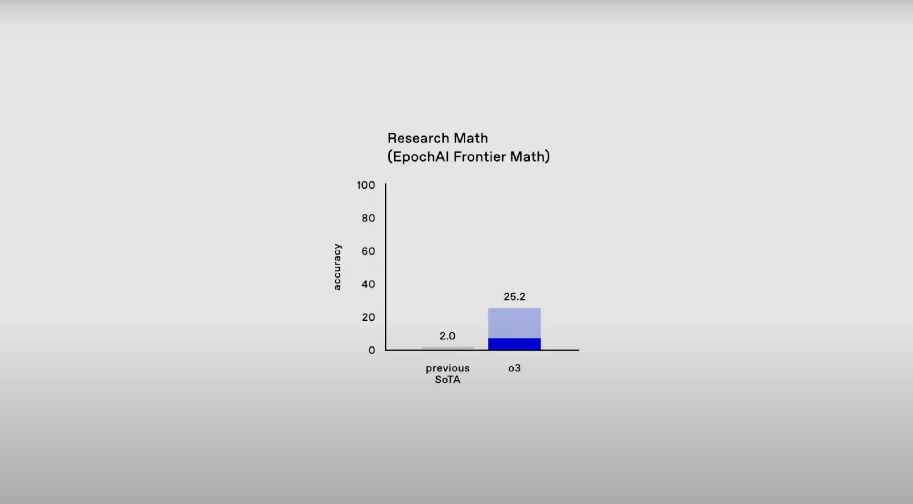
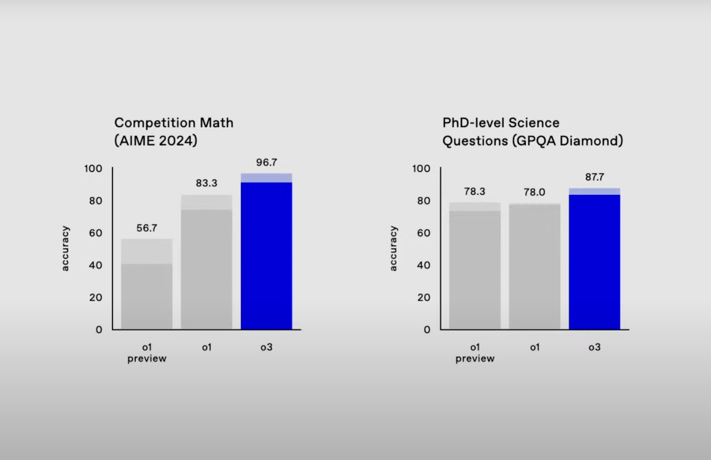
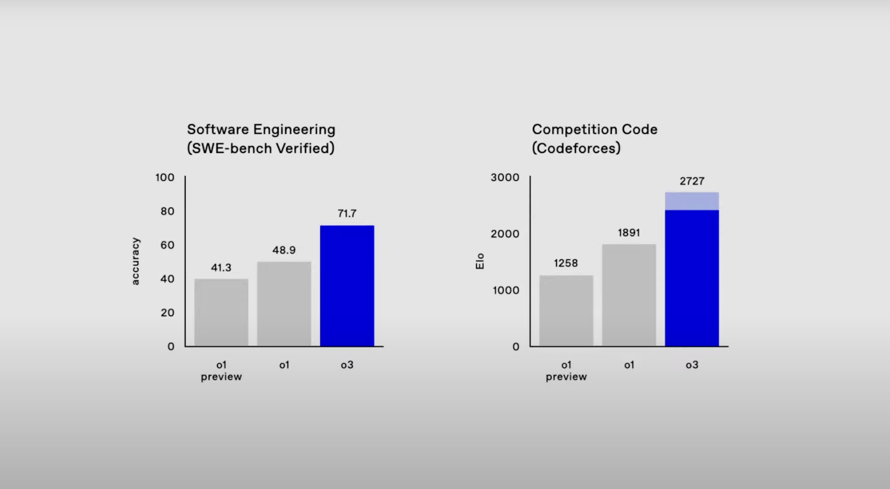
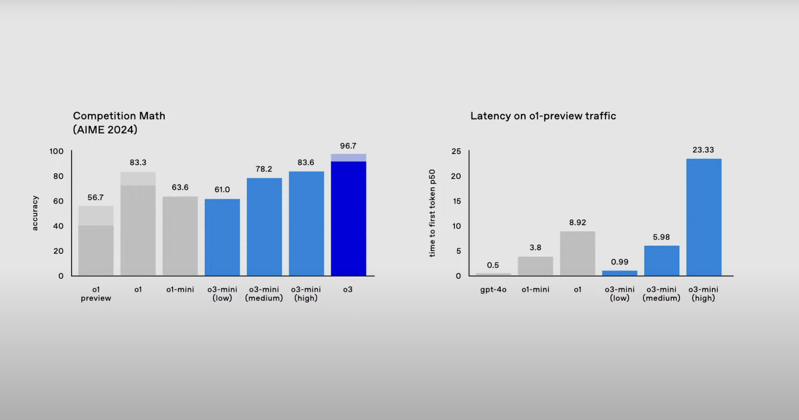

Artificial intelligence continues to redefine the boundaries of what machines can achieve, and OpenAI's latest innovation, the **o3 model**, represents a monumental leap forward. With its ability to outperform benchmarks once thought insurmountable, o3 sets a new standard for AI reasoning and problem-solving. This blog explores o3's groundbreaking capabilities, development process, and implications for the future of AI. (Inspired by AI Explained's [youtube video](https://youtu.be/YAgIh4aFawU?si=SGea3P6p0eJ9VB-X))

---

## **Breaking Barriers: Key Achievements of o3**

The o3 model showcases unparalleled performance across various domains, demonstrating its potential as a transformative tool for AI research and practical applications.

#### **1. Frontier Math Benchmarks: From Impossible to Mastered**
The **Frontier Math benchmark**, designed to challenge the limits of AI, was considered unbeatable for years. Here’s what o3 achieved:
- **25% accuracy** on a dataset of unpublished, highly complex problems, compared to less than 2% for previous models.
- Solved problems that would take human mathematicians hours or days, functioning as a true domain expert.

image source: [OpenAI Youtube](https://www.youtube.com/live/SKBG1sqdyIU)

#### **2. Graduate-Level Science Questions: Dominating GPQA**
In tackling graduate-level science questions on the **GPQA benchmark**, o3 delivered:
- **87.7% accuracy**, effectively rendering the benchmark obsolete within a year of its inception.
- Remarkable reasoning capabilities, handling complex scientific problems with precision.

#### **3. Competitive Coding: Top Performer**
o3’s performance in competitive programming tasks is equally impressive:
- Ranked among the **top 0.05%** of global competitors, outperforming **99.95% of human coders**.
- Achieved **71.7% accuracy** on SWE-bench, a real-world software engineering benchmark, far surpassing Claude 3.5’s 49%.

#### **4. Advanced Simulated Reasoning (SR)**
One of the most notable advancements in o3 is its use of **Simulated Reasoning (SR)**:
- Unlike traditional language models, o3 incorporates a process that mirrors human-like reasoning, pausing to reflect before responding.
- This allows o3 to excel in multi-step, complex tasks by breaking them down into smaller reasoning chains.

---

## **What Sets o3 Apart? A Comparison with o1**

The leap from o1 to o3 is nothing short of transformative. Here are the key differences:

#### **1. Reinforcement Learning at Scale**
- **Candidate Generation:** o3 generates thousands of potential solutions to a problem.
- **Verifier Model:** A secondary AI evaluates and ranks these solutions, selecting and reinforcing correct reasoning steps.
- This shifts AI from generating plausible answers to **verifying objectively correct ones**, a game-changer in domains like math and coding.

#### **2. Improved Generalization and Compositionality**
- Unlike o1, which struggled with generalizing beyond training data, o3 demonstrates abstract reasoning and the ability to combine concepts into solutions.
- This enhanced compositionality makes o3 more versatile and adaptable to novel challenges.

#### **3. Multimodal Excellence**
- o3 handles diverse data types, including text and images, far better than its predecessor.
- It achieved **96.7% accuracy** on the **American Invitational Mathematics Exam (AIME)**, reflecting a deeper understanding of abstract and multimodal concepts.

#### **4. Introduction of o3-mini**
OpenAI also introduced **o3-mini**, a lightweight version of the model:
- Features adaptive processing speeds—low, medium, or high—based on user needs.
- Despite its smaller size, o3-mini outperforms o1 on several benchmarks, providing an efficient yet powerful option for diverse applications.

---

## **Implications for AI Benchmarks and Development**

#### **1. Benchmarks Are Temporary**
o3’s ability to quickly dominate benchmarks like Frontier Math and GPQA highlights the fleeting nature of these tests:
- AI evolves faster than anticipated, rendering traditional benchmarks ineffective.
- New methods for evaluating AI capabilities will be essential moving forward.

#### **2. Progress Toward AGI**
While o3 isn’t yet AGI, it represents a significant step in that direction:
- Its reasoning abilities suggest that **AGI-like capabilities** could emerge in the next iterations, such as o4 or o5.
- The line between narrow AI and general intelligence is becoming increasingly blurred.

---

## **What Software Engineers Need to Know**

The rise of o3 brings both challenges and opportunities for software professionals. Here’s how engineers can adapt:

#### **1. Embrace AI-Augmented Workflows**
- Integrate AI tools like o3 into development pipelines for debugging, optimization, and code generation.
- Focus on **collaborative workflows** where AI serves as an assistant rather than a replacement.

#### **2. Specialize in Multimodal Development**
- Develop expertise in handling diverse data types, such as text, images, and audio.
- Explore applications in IoT, robotics, and other domains where AI interacts with the physical world.

#### **3. Prioritize Ethics and Oversight**
- Address issues of bias, fairness, and transparency in AI systems.
- Develop scalable oversight mechanisms to monitor and ensure safe deployment of powerful models like o3.

#### **4. Cultivate Soft Skills**
- As AI takes over technical tasks, skills like communication, leadership, and teamwork will become critical.
- These skills will be essential for managing AI-human collaboration in diverse projects.

---

## **Conclusion: A New Era in AI**

OpenAI’s o3 model isn’t just a technological achievement—it’s a paradigm shift. By demonstrating unprecedented reasoning capabilities, o3 forces us to rethink the pace and trajectory of AI development. Its impact spans industries, from software engineering to scientific research, while raising critical questions about ethics, accessibility, and the future of AI-human collaboration.

Whether o3 is a step toward AGI or merely the next leap in a longer journey, its significance is undeniable. The future of AI is unfolding faster than we imagined, and it’s up to us to harness these advancements responsibly.

---

What are your thoughts on o3 and its implications? Let me know in the comments below!

